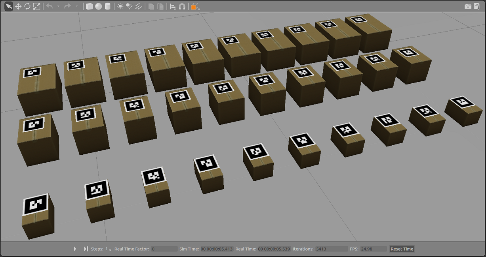

# Sortation System Demo
Author : Roberto Zegers R.

## Description
This project implements a simulated sortation system for processing parcels or goods in a distribution center. It serves as a demonstration for system integration and communication using ROS.
 The simulated environment includes a conveyor belt, a 3 degrees of freedom (DoF) cartesian robot and a camera for reading AR Tags.
The main logic consists in detecting the AR Tags on the parcels, reading their ID number, and using the robotic arm to push them to a corresponding container bin.

  
Figure 1: Some of the 72 carboard boxes with AR Tags on top included in this package.  

## Dependencies:
+ ROS Kinetic + Gazebo 7

In addition, the following ROS packages are required for running the sortation system simulated demo:  

+ **conveyor_gazebo**: Package related to simulation of a conveyor belt using Gazebo. 
+ **deflector_robot**: Contains a 3 D-O-F cartesian robot including the Gazebo model, controllers, and nodes for communications. 
+ **ar_track_alvar**: Provides the ID, x, y, z position and orientation of AR tags.
+ **object_spawner**: Convenience tool for spawning models into simulation.

## Usage:

Run all neccesary components by executing the included bash script (xterm required):   
`./start_demo.sh`

Or alternatively start the demo launching every node manually:

1. **Fire up Gazebo world with conveyor belt model & plugin:**  
  `$ roslaunch conveyor_gazebo conveyor.launch`  
2. **In a new terminal spawn the portal frame, camera and deflector robot:**  
  `$ roslaunch sortation_system spawn_portal_frame.launch`  
  `$ roslaunch sortation_system spawn_camera_link.launch`  
  `$ roslaunch deflector_robot spawn_robot.launch`  
3. **Execute the robot controllers:**  
  `$ roslaunch deflector_robot ctrl_manager.launch`  
4. **In a new window activate the conveyor belt:**  
  `$ rosservice call /conveyor/control "state:  power: 20.0"`  
5. **Then launch the object_spawner node, to spawn parcels with AR tags:**  
  `$ roslaunch sortation_system object_spawner.launch`  
6. **In a new terminal windows tart RVIZ with a preconfigured view**  
  `$ roslaunch sortation_system rviz.launch`  
7. **Launch ar_track_alvar to detect AR markers and localize them in space:**  
  `$ roslaunch sortation_system ar_track.launch`  
8. **And in a new terminal window execute the sortation manager code:**  
  `$ rosrun sortation_system sortation_manager`  
9. **Finally unpause the simulation pyhisics:**  
  `$ rosservice call /gazebo/unpause_physics '{}'`  

## Topics
+ /camera1/image_raw
+ /camera1/camera_info
+ /deflector/joint1_position_controller/command
+ /deflector/joint2_position_controller/command
+ /deflector/joint3_position_controller/command

## Testing and debugging
Use image_view to see camera video published by the Gazebo camera plugin:  
`$ rosrun image_view image_view image:=/camera1/image_raw`  

## Install:

`$ sudo apt-get install ros-kinetic-ar-track-alvar`  
`$ git clone https://github.com/rfzeg/deflector_robot.git`  
`$ git clone https://github.com/rfzeg/conveyor_gazebo.git`  
`$ git clone https://github.com/rfzeg/object_spawner.git`  

Then run catkin_make and source your ROS environment.  

### Troubleshooting

Error message "/opt/ros/kinetic/lib/ar_track_alvar/individualMarkersNoKinect: error while loading shared libraries: libopencv_core3.so.3.3: cannot open shared object file: No such file or directory"  
First run: `$ pkg-config --modversion opencv`  
If the following message displays: "Package opencv was not found in the pkg-config search path", install opencv3:  
`$ sudo apt-get install libopencv-dev`  

And run:  
`$ sudo apt-get update`  
`$ sudo apt-get dist-upgrade`  

## To-do's:

Resize camera mesh with Blender:  

+ File → Import → Collada (.dae)
+ Pull out the right-tab in blender (look for a plus sign near the upper right of the render window). Under the Dimensions section of this tab, divide the x,y,z components by 1000. NOTE: At the moment scalling is applied using the <scale> tag.
+ File → Export → Collada (.dae) → Export COLLADA

## Resources:
+ http://wiki.ros.org/xacro
